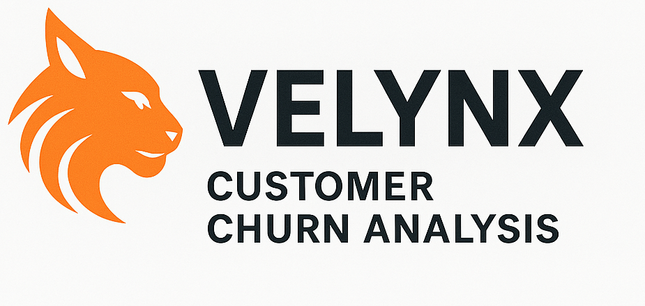
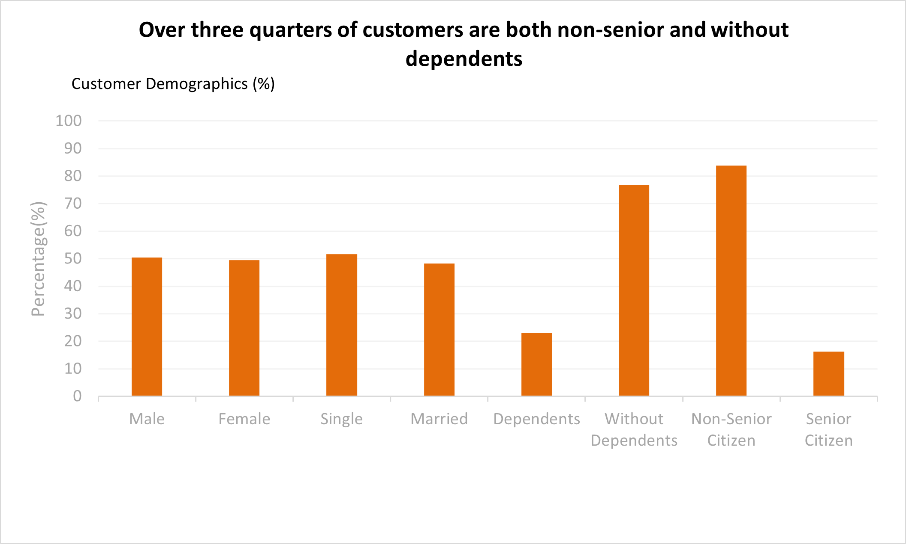
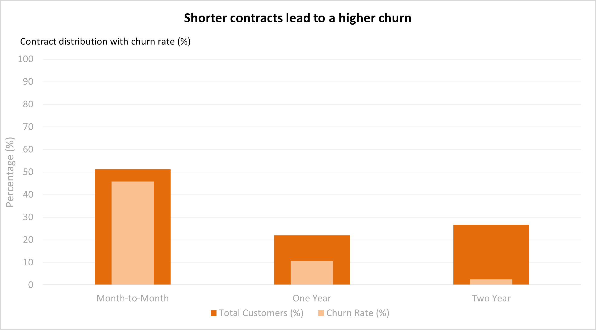
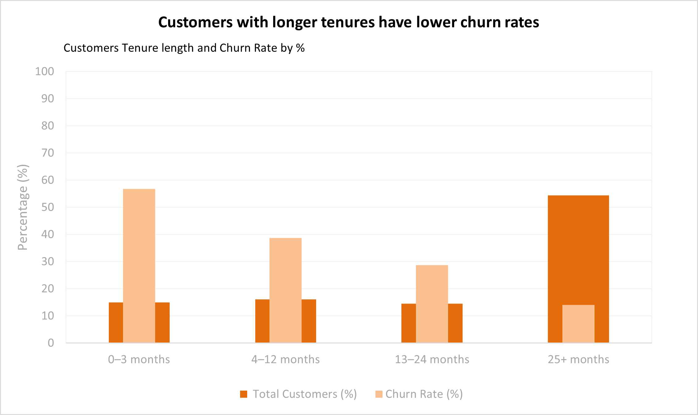
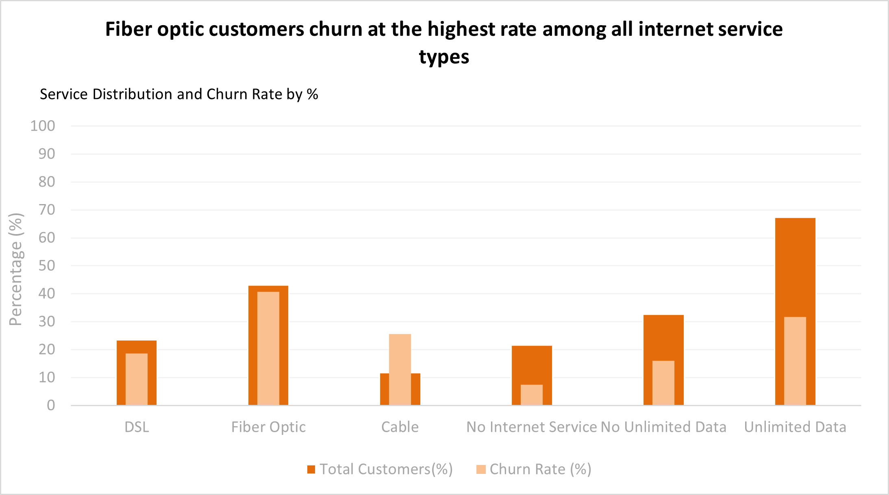
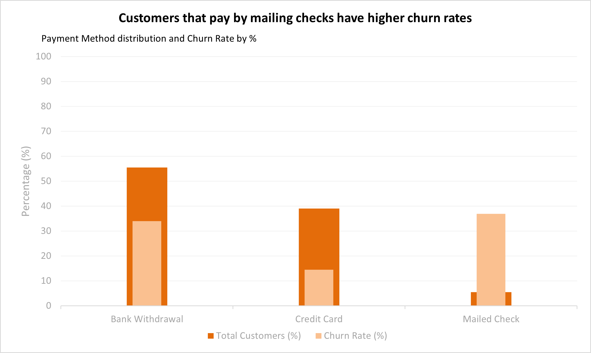

## Table of Contents
- [Background and Overview](#background-and-overview)
- [Dataset Overview](#data-structure-overview)
- [Executive Summary](#executive-summary)
- [Key Insights](#insights-deep-dive)
- [Insights to Action](#recommendations)

## Background and Overview
Velynx is a fictional U.S.-based telecommunications provider offering broadband internet and phone (home and mobile) services. Velynx competes in a fast-moving market where customer loyalty is critical to long-term success.

Velynx is facing a growing challenge with customer churn, which threatens both revenue stability and future growth. This project analyzes demographic and service-related data to pinpoint the biggest churn drivers, focusing on broadband service types (DSL, Fiber Optic, Cable), data plan choices, contract structures, and payment methods, and applies these findings to develop data-driven recommendations aimed at improving customer retention.

Insights from this analysis are grouped into the following key areas:
- **Customer Demographics** – How factors such as gender, age group, and dependent status influence churn.  
- **Service Types** – Churn patterns across different internet service offerings.  
- **Contract and Payment Types** – The role of contract length and payment method in customer retention.  
- **Tenure** – How the length of time a customer has been with Velynx correlates with churn rates.  

## Dataset Overview
This analysis uses a dataset of 7,043 customers containing 38 variables covering demographic details, account information, and service usage. Each record includes whether the customer churned, as well as key attributes such as gender, age, marital and dependent status, broadband service type (DSL, Fiber Optic, Cable), data plan type, contract length, payment method, satisfaction score, churn score, and customer lifetime value (CLTV). This combination of data provides a comprehensive view of the factors that may influence customer churn.

The dataset that was used can be found here [Kaggle Telco Customer Churn Data](https://www.kaggle.com/datasets/alfathterry/telco-customer-churn-11-1-3)

Table columns can be found [here](sql/Create_Table.sql)

## Executive Summary
### Summary
The overall churn rate for Velynx stands at 26.54%. The analysis shows that senior citizens, customers without dependents, and single customers exhibit notably higher churn rates. Month-to-month contract holders churn at a much higher rate than those with one or two year agreements, while fiber optic users show higher churn compared to DSL and cable subscribers. Customers using electronic checks as their payment method are also more likely to leave. Addressing these high-risk groups with targeted, data-driven retention strategies could significantly improve customer loyalty and revenue stability.

## Key Insights
### Customer Demographics

### Customer Demographic Churn Rate

| Category            | Total Customers | Churned Customers | Churn Rate (%) |
|---------------------|----------------:|------------------:|---------------:|
| Male                |           3,555 |               930 |          26.16 |
| Female              |           3,488 |               939 |          26.92 |
| Single              |           3,641 |             1,200 |          32.96 |
| Married             |           3,402 |               669 |          19.66 |
| Dependents          |           1,627 |               106 |           6.52 |
| No Dependents       |           5,416 |             1,763 |          32.55 |
| Senior Citizen      |           1,142 |               476 |          41.68 |
| Non-Senior Citizen  |           5,901 |             1,393 |          23.61 |

### Contract and Tenure

### Service Types

### Payment

## Insights to Action 

